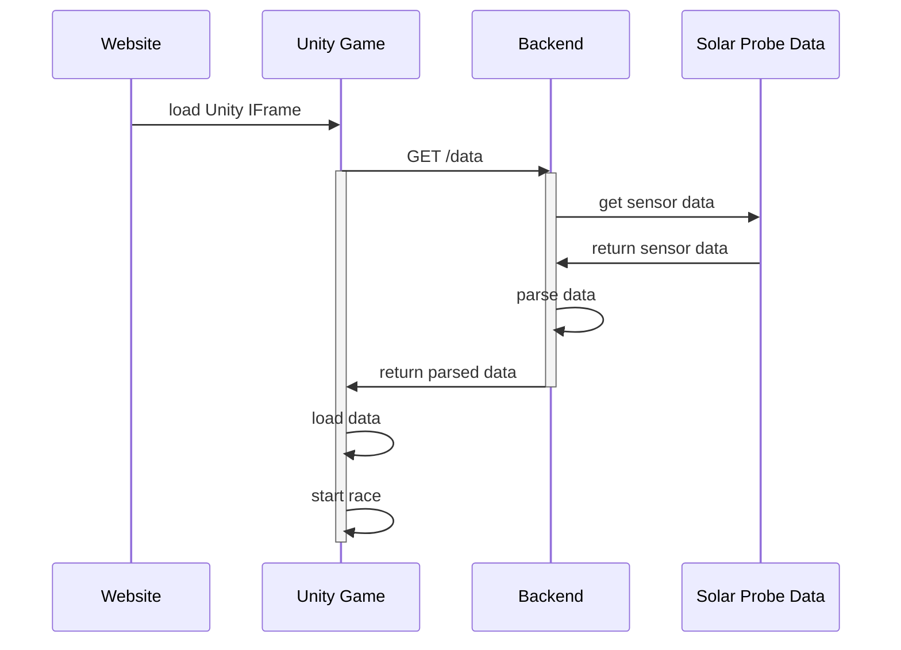

# Solar Wind Cars

Project made on [NASA Space Apps Challenge Prague 2022](https://2022.spaceappschallenge.org/) hackathon. The challenge was to display creatively  data form Parker Solar Probe.

Our team was called Singularity

## What we created

* [Racing car game](https://github.com/team-singularity/solar-wind-cars-unity)
* [Website with education content](https://github.com/team-singularity/solar-wind-cars-FE)
* [Backend that parses data from Parek Solar Probe](https://github.com/team-singularity/solar-wind-cars-be)

## Technology
 * Unity
 * HTML/CSS/JS
 * Java BE with Spring Boot

## Team
👨[karmik66](https://github.com/karmik66)

👩[gabriela-l](https://github.com/gabriela-l)

👨[martinbacon](https://github.com/martinbacon)

<!--

**Here are some ideas to get you started:**

🙋‍♀️ A short introduction - what is your organization all about?
🌈 Contribution guidelines - how can the community get involved?
👩‍💻 Useful resources - where can the community find your docs? Is there anything else the community should know?
🍿 Fun facts - what does your team eat for breakfast?
🧙 Remember, you can do mighty things with the power of [Markdown](https://docs.github.com/github/writing-on-github/getting-started-with-writing-and-formatting-on-github/basic-writing-and-formatting-syntax)
-->
